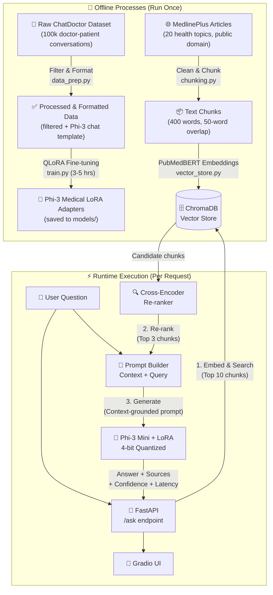

# 🏥 Medical QA AI Assistant — System Design & Architecture

> **A production-style medical Q&A system** combining a QLoRA fine-tuned LLM with a two-pass RAG pipeline, served via a FastAPI backend and deployed on Hugging Face Spaces.

---

## 🗺️ High-Level Architecture

The system is divided into two primary phases:

- **Offline:** Everything that happens once — data processing, model training, and populating the vector database.
- **Runtime:** Everything that happens live — accepting a user's question and returning a grounded, accurate answer.



---

## 1️⃣ Data Processing Pipeline

> *Establishing a high-quality foundation for model training.*

| Step | Detail |
|---|---|
| **Source Dataset** | [`lavita/ChatDoctor-HealthCareMagic-100k`](https://huggingface.co/datasets/lavita/ChatDoctor-HealthCareMagic-100k) |
| **Min. Output Length** | 100 chars — removes non-informative responses like *"Please consult a doctor"* |
| **Max. Output Length** | 2000 chars — ensures text fits within the 512-token training limit |
| **Min. Input Length** | 10 chars — eliminates empty or malformed patient queries |
| **Output Format** | Phi-3 chat template with `<\|system\|>`, `<\|user\|>`, `<\|assistant\|>` turn markers |

> [!NOTE]
> After filtering, ~80–85% of examples pass. The filters are conservative — a mediocre example is kept over throwing away too much data.

---

## 2️⃣ Model Fine-Tuning (QLoRA)

> *Adapting a general-purpose LLM into a specialized medical assistant.*

| Parameter | Value | Reason |
|---|---|---|
| **Base Model** | `microsoft/Phi-3-mini-4k-instruct` (3.8B) | Strong instruction-following baseline that fits in 6GB VRAM |
| **Quantization** | 4-bit NormalFloat (NF4) via `bitsandbytes` | Reduces memory footprint from ~8GB → ~2.5GB |
| **LoRA Rank (r)** | 16 | Optimal balance between expressiveness and parameter count |
| **Target Layers** | `q_proj`, `v_proj`, `k_proj`, `o_proj` | Attention layers capture the most fine-tuning signal |
| **Trainable Params** | ~0.05% of total | Only LoRA adapter matrices are updated, not the full model |
| **Experiment Tracking** | MLflow | Logs hyperparameters, loss curve, and metrics per run |

> [!TIP]
> The output is lightweight LoRA adapter weights (~6MB `.safetensors`), fully decoupled from the 3.8B base model. This makes sharing and versioning trivial.

---

## 3️⃣ Retrieval-Augmented Generation (RAG)

> *Grounding AI responses in verified medical literature to mitigate hallucination.*

### Why RAG?
Fine-tuning teaches the model *how* to respond (tone, format, persona). RAG gives the model *what* to say — factual, up-to-date information it can cite. Together they address both *style* and *accuracy*.

### Knowledge Base
- **Source:** MedlinePlus health topic summaries (public domain, high clinical reliability)
- **Coverage:** 20 common conditions — diabetes, hypertension, asthma, depression, and more

### Two-Pass Retrieval Strategy

```
User Question
     │
     ▼
[1] Bi-Encoder (PubMedBERT)  ──►  Top 10 candidate chunks  (fast, approximate)
     │
     ▼
[2] Cross-Encoder (ms-marco) ──►  Top 3 re-ranked chunks   (slow, precise)
     │
     ▼
Injected into LLM system prompt as context
```

| Component | Model | Role |
|---|---|---|
| **Embedding** | `pritamdeka/S-PubMedBert-MS-MARCO` | Converts text to medical-domain vectors |
| **Vector DB** | ChromaDB (local, persistent) | Stores and retrieves chunks by similarity |
| **Re-ranker** | `cross-encoder/ms-marco-MiniLM-L-6-v2` | Deep relevance scoring of query + chunk pairs |

> [!IMPORTANT]
> The bi-encoder evaluates the query and documents *separately* — it's fast but approximate. The cross-encoder evaluates them *together*, capturing deep word interactions. This two-pass approach gets the speed of vector search with the accuracy of a cross-encoder.

---

## 4️⃣ API & UI Layer

> *Serving the model to end-users efficiently.*

### FastAPI Backend (`src/api/main.py`)

| Endpoint | Method | Description |
|---|---|---|
| `/health` | `GET` | Uptime check — returns `{"status": "ok"}` |
| `/ask` | `POST` | Accepts `{"question": "..."}` and returns a full response |

**`/ask` Response Shape:**
```json
{
  "answer": "Type 2 diabetes is characterized by...",
  "sources": ["Diabetes occurs when...", "Blood sugar levels..."],
  "confidence": "high",
  "latency_seconds": 4.23
}
```

**Confidence Scoring:** Uses cosine similarity between the question embedding and the retrieved source embeddings. `avg_similarity > 0.5` → `"high"`, `> 0.3` → `"medium"`, else `"low"`.

### Gradio UI
- Wraps the entire multi-model pipeline into a simple web interface
- Displays both the generated answer and the source medical chunks used to ground it

---

## 5️⃣ Evaluation & Testing

> *Ensuring correctness before deployment.*

### Automated API Tests (`tests/test_api.py`)
Uses FastAPI's `TestClient` to run 4 automated checks:
- ✅ Health endpoint returns `200 OK`
- ✅ A valid question returns an answer `> 10 chars`
- ✅ An empty question returns a `400 Bad Request`
- ✅ The response includes at least one source chunk

### Batch Evaluation Script (`src/evaluation/evaluate.py`)
Runs the full pipeline on 5 fixed medical questions and checks answers against expected topics using multi-alias keyword matching (e.g., `"urination"` also matches `"polyuria"`, `"frequent urination"`).

---

## 6️⃣ Deployment

> *Making the system publicly accessible.*

| Component | Platform |
|---|---|
| **Fine-tuned Model** | [Hugging Face Hub](https://huggingface.co/koi-bito/phi3-medical-lora) |
| **Cloud Inference** | Groq API (`llama3-8b-8192`) — for fast public demo |
| **Web App** | Hugging Face Spaces (Gradio) |
| **CI/CD** | GitHub Actions — runs `pytest` on every push to `main` |

> [!WARNING]
> **This is an educational project and is NOT a substitute for professional medical advice.** The model may hallucinate. Always verify with a qualified healthcare professional.
