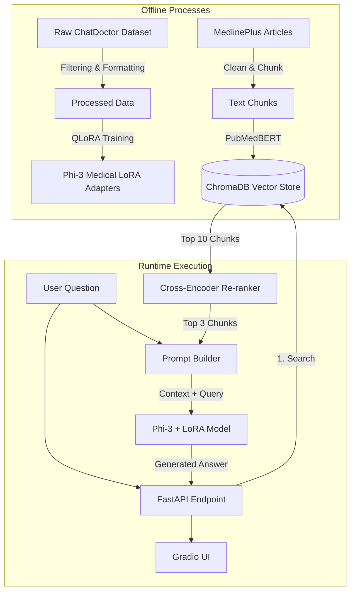

# 🏥 Medical QA AI Assistant - System Design & Architecture

This document provides a comprehensive overview of the architecture, data flow, and technical design decisions behind the Medical QA AI Assistant. It outlines the end-to-end pipeline from data preparation and model fine-tuning to the Retrieval-Augmented Generation (RAG) system and API deployment.

---

## 🏗️ High-Level Architecture

The system is divided into two primary phases: **Offline Processes** (data processing, training, and database population) and **Runtime Execution** (handling live queries).

---

## 1️⃣ Data Processing Pipeline

_Establishing a high-quality foundation for model training._

- **Source Dataset:** [`lavita/ChatDoctor-HealthCareMagic-100k`](https://huggingface.co/datasets/lavita/ChatDoctor-HealthCareMagic-100k)
- **Data Filtering Strategy:**
  - **Minimum Output Length (100 chars):** Removes non-informative, generic responses (e.g., "Please consult a doctor").
  - **Maximum Output Length (2000 chars):** Ensures the text fits comfortably within the model's 512-token sequence limit alongside system prompts.
  - **Minimum Input Length (10 chars):** Eliminates empty or severely malformed patient queries.
- **Formatting:** Transformed into the Phi-3 chat template format, utilizing `<|system|>`, `<|user|>`, and `<|assistant|>` markers to establish clear conversational boundaries.

## 2️⃣ Model Fine-Tuning

_Adapting a generalized language model into a specialized medical assistant._

- **Base Model:** `microsoft/Phi-3-mini-4k-instruct` (3.8 Billion parameters)
- **Optimization Strategy:** Parameter-Efficient Fine-Tuning (PEFT)
- **Quantization:** Loaded in 4-bit NormalFloat (NF4) via `bitsandbytes` to constrain memory usage to a 6GB VRAM footprint.
- **QLoRA Parameters:**
  - **Rank (r):** 16 (Optimal balance between parameter count and expressiveness)
  - **Target Modules:** `q_proj`, `v_proj`, `k_proj`, `o_proj` (Attention layers)
- **Experiment Tracking:** Integrated with **MLflow** to log hyperparameters, steps, and loss metrics.
- **Output:** LoRA adapter weights, decoupling the trained specialized behavior from the heavy base model.

## 3️⃣ Retrieval-Augmented Generation (RAG)

_Grounding AI responses in verified medical literature to mitigate hallucination._

- **Knowledge Base:** MedlinePlus health topic summaries, chosen for their reliability and public domain availability.
- **Data Chunking:** Documents are split into manageable ~400-word chunks. A 50-word overlap is maintained between chunks to prevent cutting off crucial context at arbitrary boundaries.
- **Vector Database:** **ChromaDB** serves as the persistent local storage for rapid semantic retrieval.
- **Embedding Model:** `pritamdeka/S-PubMedBert-MS-MARCO` – A model specifically trained on medical text, significantly outperforming generic embedders for healthcare vocabulary.
- **Two-Pass Retrieval System:**
  1. **Semantic Search (Bi-Encoder):** Rapidly pulls the top 10 most relevant chunks from ChromaDB.
  2. **Re-ranking (Cross-Encoder):** Uses `cross-encoder/ms-marco-MiniLM-L-6-v2` to deeply analyze the relationship between the query and the 10 retrieved chunks, scoring and sorting them to select the absolute top 3 for maximum relevance.
- **Context Injection:** The winning chunks are formatted directly into the LLM's system prompt prior to generation.

## 4️⃣ API and UI Layer

_Serving the model to end-users efficiently._

- **Backend Framework:** **FastAPI** provides a robust, asynchronous REST interface.
- **Primary Endpoints:**
  - `/health`: Uptime monitoring.
  - `/ask`: Receives user queries, orchestrates the entire RAG pipeline (Retrieval -> Prompting -> Generation), and returns the answer alongside a confidence score (derived from embedding similarity) and processing latency.
- **User Interface:** **Gradio** provides a clean, web-based chat interface for seamless user interaction.

## 5️⃣ Evaluation and Deployment

_Ensuring quality and accessibility._

- **Evaluation:** The system is evaluated through batch testing against an established set of medical questions, analyzing both the relevance of the retrieved context and the clinical safety/accuracy of the final generated response.
- **Deployment:** The full application is packaged and deployed publicly as a Gradio web application hosted on **Hugging Face Spaces**.
