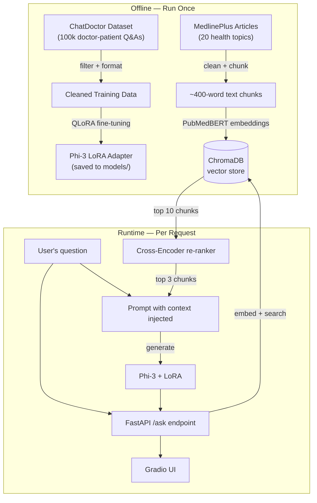

# Medical QA AI Assistant — System Design

This document explains how the system works and why I made the design decisions I did. It's written for someone who wants to actually understand the architecture, not just skim a bullet list.

---

## The Problem

Medical questions are one of the most common things people search online, and most of the time they get back SEO-optimized blog posts or generic WebMD pages. I wanted to build something that could give a more direct, contextualized answer — while being honest about its limitations.

The challenge is that a language model alone isn't reliable enough for this. It can sound confident while being completely wrong. So the architecture needed two things working together: a model fine-tuned to *respond like a medical assistant*, and a retrieval system grounded in *actual verified medical text*.

---

## How It Works (High Level)

There are two phases — things that happen once (offline), and things that happen every time someone asks a question (runtime).



The offline work is done once and saved to disk. At runtime, we're just doing retrieval + generation — no training happening live.

---

## Data Preparation

The raw ChatDoctor dataset has 100k examples, but a lot of them are garbage. Things like:

- Answers that are just "Please consult a doctor" (useless — the model can't learn anything from that)
- Answers so long they overflow the context window when combined with the prompt and system message
- Patient questions that are basically empty

So I filtered it down to usable examples using three thresholds:

- **Min output length: 100 chars** — anything shorter is a non-answer
- **Max output length: 2000 chars** — keeps us safely within the 512-token training limit
- **Min input length: 10 chars** — rules out empty or near-empty patient queries

After filtering, roughly 80-85% of examples survive. I kept the thresholds conservative because throwing away too much data hurts more than keeping a few mediocre examples.

The examples are then reformatted into the Phi-3 chat template:

```
<|system|>
You are a knowledgeable medical assistant...<|end|>
<|user|>
{patient question}<|end|>
<|assistant|>
{doctor answer}<|end|>
```

Getting this format exactly right matters a lot. If you skip it or get it wrong, the model trains on jumbled text where it can't distinguish who said what.

---

## Fine-Tuning

I used QLoRA on `microsoft/Phi-3-mini-4k-instruct` (3.8B parameters). The full model in 16-bit precision wouldn't even fit in 6GB VRAM, so 4-bit quantization via `bitsandbytes` was the only way to make training feasible on my RTX 4050.

The key insight with LoRA is that you're not retraining the whole model — you freeze all the original weights and inject small trainable adapter matrices into specific layers. For this I targeted the attention projection layers (`q_proj`, `v_proj`, `k_proj`, `o_proj`) since those are where the model learns what to focus on in a conversation. With rank r=16, only about 0.05% of parameters are actually updated.

Training setup:
- 10k examples, 2 epochs
- Batch size 2 with 4 gradient accumulation steps (effective batch of 8)
- Learning rate 2e-4
- `gradient_checkpointing=True` — essential on 6GB VRAM, trades ~20% speed for ~40% memory savings

Final training loss settled around 5.59. The model successfully adopted the medical assistant persona — more hedged responses, better at saying "see a doctor" in the right contexts, and noticeably less likely to respond with generic filler answers.

All runs were tracked in MLflow, which made it easy to compare the smoke test run vs. the full training run.

---

## RAG Pipeline

Fine-tuning alone isn't enough. The model's weights are frozen after training — it can't know about a specific drug interaction it wasn't trained on, and it can hallucinate with confidence. RAG solves this by giving the model access to retrieved text at inference time.

### Knowledge Base

I used MedlinePlus health topic summaries — they're public domain, clinically reliable, and cover the common conditions a general medical QA system needs to handle. 20 topics including diabetes, hypertension, asthma, depression, migraine, etc.

### Chunking

Documents are split into ~400-word chunks with 50-word overlap between consecutive chunks. The overlap is important — without it, a sentence can get split across two chunks and lose its meaning entirely.

### Why Two-Pass Retrieval?

The first pass uses a bi-encoder (PubMedBERT) to convert both the user's question and all document chunks into vectors, then finds the 10 closest chunks by cosine similarity. This is fast but approximate — it finds chunks that are *semantically similar* but doesn't deeply analyze whether they actually answer the question.

The second pass uses a cross-encoder (`cross-encoder/ms-marco-MiniLM-L-6-v2`) which takes each (question, chunk) pair and scores them together. Because it processes them jointly, it captures word-level interactions that the bi-encoder misses. It's slower, but we're only running it on 10 candidates, not thousands — so it stays fast enough.

The top 3 chunks from re-ranking are injected directly into the system prompt before the question is passed to Phi-3.

I used PubMedBERT specifically because a domain-specific medical embedder outperforms a generic one here. Medical vocabulary is unusual — "MI" means myocardial infarction, not the state of Michigan. A model trained on medical text handles that correctly.

---

## API Layer

The API is built with FastAPI. It exposes two endpoints:

- `GET /health` — uptime check, returns `{"status": "ok"}`
- `POST /ask` — takes a question, runs the full pipeline, returns the answer

The `POST /ask` response looks like this:

```json
{
  "answer": "Type 2 diabetes is characterized by...",
  "sources": ["Diabetes occurs when the body...", "Blood sugar control involves..."],
  "confidence": "high",
  "latency_seconds": 4.23
}
```

The confidence field is a rough heuristic — I compute cosine similarity between the question embedding and the source embeddings. If the average similarity is above 0.5 it's "high", above 0.3 it's "medium", otherwise "low". It's not a calibrated probability, just a sanity signal.

One important implementation detail: all models (Phi-3, PubMedBERT, cross-encoder) are loaded once at server startup and held in memory. If you loaded them per-request, every query would take minutes just for initialization.

---

## Testing

I wrote four automated tests using FastAPI's `TestClient`:

1. Health check returns 200
2. A real question returns an answer longer than 10 characters
3. An empty/too-short question returns a 400 error
4. The response includes at least one source chunk

One thing I learned the hard way: you can't run the test suite while the uvicorn server is also running. Both try to load the full model stack into GPU memory, and a 6GB GPU can't hold two copies. Shut down the server first, then run tests.

---

## Deployment

The fine-tuned LoRA adapter is hosted on [Hugging Face Hub](https://huggingface.co/koi-bito/phi3-medical-lora). At ~6MB it's tiny and easy to version.

For the public demo I use Groq (Llama 3 via API) instead of the local Phi-3. The fine-tuned model stays local because Groq doesn't support custom models — but it's fast and free for demo purposes. The README is transparent about this trade-off.

The Gradio frontend wraps everything into a simple chat UI and is deployed to Hugging Face Spaces.

---

## Limitations

This is an educational project. The model will occasionally hallucinate, the knowledge base covers only 20 conditions, and nothing here should be used for actual medical decisions. The system always tells users to consult a real doctor — that's baked into the system prompt.
